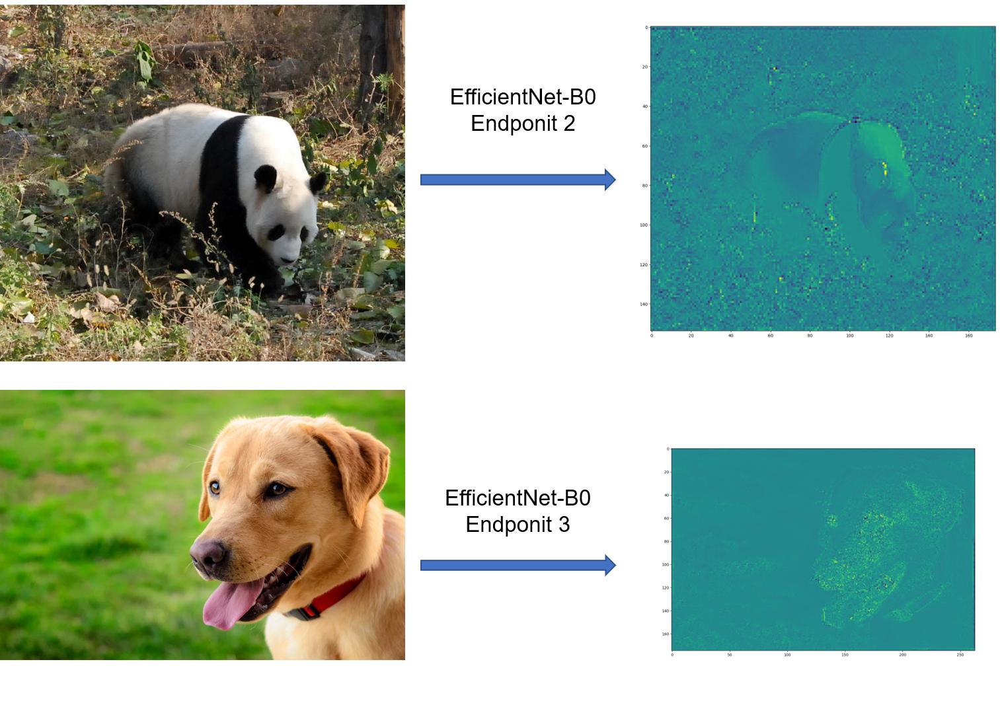
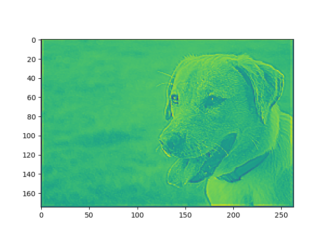

# U-Net with EfficientNet as Encoder

## Reference

### Original Paper:

- [U-Net](https://arxiv.org/abs/1505.04597)

- [Efficient Net](https://arxiv.org/abs/1905.11946)
   
   - EfficientNet B0 Architecture

      

### Existing implementation

- [EfficientUnet](https://github.com/zhoudaxia233/EfficientUnet)

- [keras-EfficientNet-Unet](https://github.com/madara-tribe/keras-EfficientNet-Unet)

- [EfficientUnet-PyTorch](https://github.com/zhoudaxia233/EfficientUnet-PyTorch)

- [Efficient Net from the original author](https://github.com/tensorflow/tpu/tree/master/models/official/efficientnet)

- [Efficient Net implementation as part of keras-applications](https://github.com/keras-team/keras-applications)

## Environment

- CUDA 11.0

- Anaconda: Python 3.7

- Tensorflow 1.15.0

## Files and directory

### scratch

Trying to build the pre-trained network following [the repo](https://github.com/tensorflow/tpu/tree/master/models/official/efficientnet) linked in the paper. 

PS: almost all code in this directory are from the linked GitHub repo above. I checked out that folder only as svn and copied it here for easy testing. **test.py** contains the code I put together for testing.

### keras_application_efficientnet

Trying to build a trainable U-Net with EfficientNet as encoder. All files in keras_applications are from [Efficient Net implementation as part of keras-applications](https://github.com/keras-team/keras-applications).


## Notes

### Using Pretrained EfficientNet Checkpoints

#### Downloading the checkpoints

They provided downloadable link inside the README.md file. For EfficientNet-B0 with baseline preprocessing (which is what I am testing with), the download link is: https://storage.googleapis.com/cloud-tpu-checkpoints/efficientnet/ckpts/efficientnet-b0.tar.gz

Also notice that to work with EfficientNet-B0 only, a lot of the providied files won't be needed. For instnace, ```/condconv, /lite``` . But one will need to remove those case-switch (if conditions) in the corresponding Python file.

#### Using pre-trained checkpoints to run inference

Following the code provided in this [notebook](https://github.com/tensorflow/tpu/blob/master/models/official/efficientnet/eval_ckpt_example.ipynb), one can extract the following code to quickly run inference using trained EfficientNet-B0. It worked with the panda image they provided.

I also tested it with a [random labrador retriver image](https://duckduckgo.com/?q=Labrador+Retriever&t=brave&iax=images&ia=images&iai=https%3A%2F%2Fimages.wagwalkingweb.com%2Fmedia%2Fdaily_wag%2Fname_guides%2Flabrador-retriever-dog-names%2Fhero%2Flabrador-retriever-dog-names.jpg) from the Internet and it worked.

```Python
   import eval_ckpt_main as eval_ckpt

   model_name = 'efficientnet-b0'
   ckpt_dir = model_name
   eval_driver = eval_ckpt.get_eval_driver(model_name)
   print(type(eval_driver))

   image_file = 'labrador.jpg'
   image_files = [image_file]

   labels_map_file = 'labels_map.json'

   pred_idx, pred_prob = eval_driver.eval_example_images(
      ckpt_dir, image_files, labels_map_file
   )

   print(pred_idx, pred_prob)
```

```
predicted class for image labrador.jpg: 
  -> top_0 (31.24%): Labrador retriever  
  -> top_1 (27.72%): Rhodesian ridgeback  
  -> top_2 (5.52%): golden retriever  
  -> top_3 (2.60%): American Staffordshire terrier, Staffordshire terrier, American pit bull terrier, pit bull terrier  
  -> top_4 (1.52%): Chesapeake Bay retriever  
[array([208, 159, 207, 180, 209], dtype=int64)] [[0.31241608, 0.2772191, 0.05522349, 0.02598137, 0.015168291]]
```

This image is of dimension 2100 x 1400, meaning the pre-trained model can potentially take images of arbitrary dimensions? Or does the model have layers that scales everything to a fixed dimension (256 by 256 for ImageNet?)

#### Using EfficientNet as Feature Extractor

Adding a few parameters to the provided code in the README file, we can see the features extracted by the pre-trained EfficientNet-B0.

```Python

   import efficientnet_builder
   import numpy as np

   """
   # random input
   input_name = 'random'
   # images = np.random.random(size=(1, 224, 224, 3))
   images = np.random.random(size=(1, 1024, 1024, 3))
   """

   # input as panda
   input_name = 'panda'
   import imageio
   images = imageio.imread("%s.jpg"%input_name)
   images = np.reshape(images, (1, images.shape[0], images.shape[1], images.shape[2]))
   images = images.astype(np.float32)
   print(images.shape, images.dtype)

   images = tf.convert_to_tensor(images)
   print(images.shape, images.dtype)
   model_name = 'efficientnet-b0'
   features, endpoints = efficientnet_builder.build_model_base(
      images=images,
      model_name=model_name,
      training=True
   )

   print(type(features))
   print(type(endpoints))

   endpoint_tensors = []
   for i in range(1, 6):
      endpoint_tensors.append(endpoints['reduction_%d' % i])

   endpoint_numpys = []

   sess = tf.Session()
   with sess.as_default():
      init = tf.global_variables_initializer()
      sess.run(init)
      features_numpy = features.eval()
      print(type(features_numpy))
      print(features_numpy.shape, features_numpy.dtype)

      for endpoint_tensor in endpoint_tensors:
         endpoint_numpy = endpoint_tensor.eval()
         print(endpoint_numpy.shape)
         endpoint_numpys.append(endpoint_numpy)

   # let's save some features and see what they are
   import random
   import matplotlib.pyplot as plt

   random_c = random.sample(range(320), 16)
   print(random_c)

   fig, axs = plt.subplots(4, 4)
   fig.set_size_inches(12, 12)
   for rr in range(4):
      for cc in range(4):
         axs[rr, cc].imshow(features_numpy[0, :, :, random_c[rr * 4 + cc]])
         #axs[rr, cc].axis('off')
   plt.tight_layout()
   plt.savefig(os.path.join(dev_tmp, '%s_features.png' % input_name))
   plt.clf()

   for i in range(1, len(endpoint_numpys) + 1):
      endpoint_numpy = endpoint_numpys[i - 1]
      plt.imshow(endpoint_numpy[0, :, :, 0])
      plt.savefig(os.path.join(dev_tmp, '%s_first_map_in_endpoint_%d.png' % (input_name, i)))
      plt.clf()
```

The code above will run the pre-trained model on given images and plot the features as well as endpoints results from the network. 

For the labrador image (original dimension 1400, 2100), the endpoints layers will have shapes:

```
(1, 700, 1050, 16)
(1, 350, 525, 24)
(1, 175, 263, 40)
(1, 88, 132, 112)
(1, 44, 66, 320)
```

And these endpoints look pretty cool. Totally see the potential for segmentation/detection here.

Activation map (endpoitns) for the panda image and labrador image:




### Using Pretrained EfficientNet from Keras applications

#### Getting the pre-trained weights as encoder

The following code will suffice:

```Python
import tensorflow as tf
print(tf.__version__)
import numpy as np
from keras_applications import efficientnet

model = efficientnet.EfficientNetB0(
    include_top=False,
    weights='imagenet',
    input_tensor=None,
    input_shape=(224,224,3),
    pooling=None,
    classes=1,
    backend=tf.keras.backend,
    layers=tf.keras.layers,
    models=tf.keras.models,
    utils=tf.keras.utils
)

model.summary()

model.save('EfficientNet-B0_keras.h5')
```

Notice that the **kwargs in the function definition are left for the last 4 arguments. I think they can also be set in the __init__.py file.

Last layer and number of parameters:

```
top_activation (Activation)     (None, 7, 7, 1280)   0           top_bn[0][0]                     
==================================================================================================
Total params: 4,049,564
Trainable params: 4,007,548
Non-trainable params: 42,016
__________________________________________________________________________________________________
```

Appraently we can also leave the image size as (None, None, 3), which does not change the number of parameters at all. 
It only cares about the channel dimension. 

Let's take a look at all the layers and their shape:

```
block1a_project_bn (?, 112, 112, 16)
block2a_project_bn (?, 56, 56, 24)
block2b_project_bn (?, 56, 56, 24)
block3a_project_bn (?, 28, 28, 40)
block3b_project_bn (?, 28, 28, 40)
block4a_project_bn (?, 14, 14, 80)
block4b_project_bn (?, 14, 14, 80)
block4c_project_bn (?, 14, 14, 80)
block5a_project_bn (?, 14, 14, 112)
block5b_project_bn (?, 14, 14, 112)
block5c_project_bn (?, 14, 14, 112)
block6a_project_bn (?, 7, 7, 192)
block6b_project_bn (?, 7, 7, 192)
block6c_project_bn (?, 7, 7, 192)
block6d_project_bn (?, 7, 7, 192)
block7a_project_bn (?, 7, 7, 320)
```

It seems that all the blocks end with batch normalization layers. I think this will be what the U-Net look like after construction:


#### Verify the pre-trained weights are actaully pre-trained

Let's look at the output after block3b_project_bn in the pre-trained network loaded from keras applications:



Code used

```Python
input_name = 'labrador'
import imageio
images = imageio.imread("%s.jpg"%input_name)
images = np.reshape(images, (1, images.shape[0], images.shape[1], images.shape[2]))
images = images.astype(np.float32)
print(images.shape, images.dtype)


eunet = efficientnet_unet(input_shape=images.shape[1:])

layer_3b = eunet.get_layer(name='block3b_project_bn')
inter_model = tf.keras.Model(inputs = eunet.input, outputs = layer_3b.output)
activation_maps = inter_model.predict(images)


import matplotlib.pyplot as plt
import os

dev_tmp = r'./../tmp'
ks = [0, 10, 20]
for k in ks:
    plt.imshow(activation_maps[0, :, :, k])
    plt.savefig(os.path.join(dev_tmp, 'keras_3b_channel_%d__%s.png'%(k, input_name)))
    plt.clf()
```

It's hard to tell whether this proofs that the network is pre-trained or not... Because random weights also give images kind of like this.


## TODO

@DONE check out the implementation provided in the [keras-applications repo](https://github.com/keras-team/keras-applications). Seems that this repo has code that's editable in terms of model architecture. Also, it looks much cleaner (?), without too many dependencies. Most of the functions seemed to be implmemented within that same file for efficientnet.


@TODO Add skip connections and everything else to this model. Hopefully we'll get a trainable U-Net soon.

- basically had a wrapper model, now only need to do skip connections and conv2d and upsampling

@DONE check the efficientnet from Keras with the panda image above, making sure it actually has pre-trained weights
